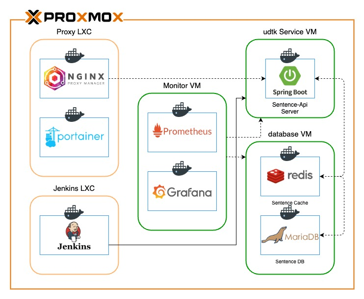

# Random Sentence API

## 🗂️ Data Source

- traditional korean proverbs, more than 4,000
    - from https://www.krpia.co.kr/product/main?plctId=PLCT00004626#none
- quotes, more than 200 (more to be added)
    - from https://www.goodreads.com/quotes (soon)
- maxim (soon)

---

## 📚 Instruction

(No author information is provided for traditional Korean proverbs.)

### 1. `https://sentence.udtk.site/{id}`

- **description** : return a sentence by id

### 2. `https://sentence.udtk.site/random?count=`

- **description** : return several random sentences
- request parameter : `count`
    - count : number of sentences to get
        - range : 1 ~ 20
        - default : 1

### 3. `https://sentence.udtk.site/language?language=&count=`

- **description** : return random sentences in chosen language
- request parameter : `language`, `count`
    - language : `kor`, `eng`
        - default : `kor`
    - count : number of sentences to get
        - range : 1 ~ 20
        - default : 1

### 4. `https://sentence.udtk.site/sort?sort=&count=`

- **description** : return random sentences in chosen sort
- request parameter : `sort`, `count`
    - sort : `가1`, `가2`, `나`, `다`, `마`, `바`, `사1`, `사2`, `아1`, `아2`, `자1`, `자2`, `차`, `카`, `타`, `파`, `하`, `quote`
        - default : `가1`
    - count : number of sentences to get
        - range : 1 ~ 20
        - default : 1

### response example

ex) `https://sentence.udtk.site/random?count=2`

```json
[
  {
    "author": null,
    "content": "쌀은 쏟고 주어도 말은 하고 못 줏는다."
  },
  {
    "author": null,
    "content": "찬 소리는 무덤 앞에 가 하여라"
  }
]
```

### ❗️request limit

- ***20 requests per 5 minutes***
- when the limit is exceeded, the response will be `429 Too Many Requests`
- time left to reset the limit will be included in the response header `X-Rate-Limit-Retry-After-Seconds`

---

## 🛠️ Stack

- Java 17
- Spring Boot 3.3.3
- Spring Data JPA
- bucket4j
- MariaDB
- Redis
- Docker
- Nginx
- Jenkins
- Proxmox

---

## 🏗️ Architecture


